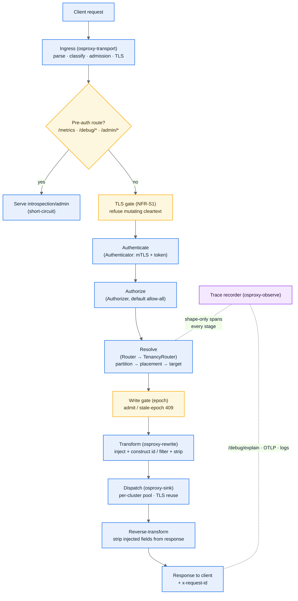
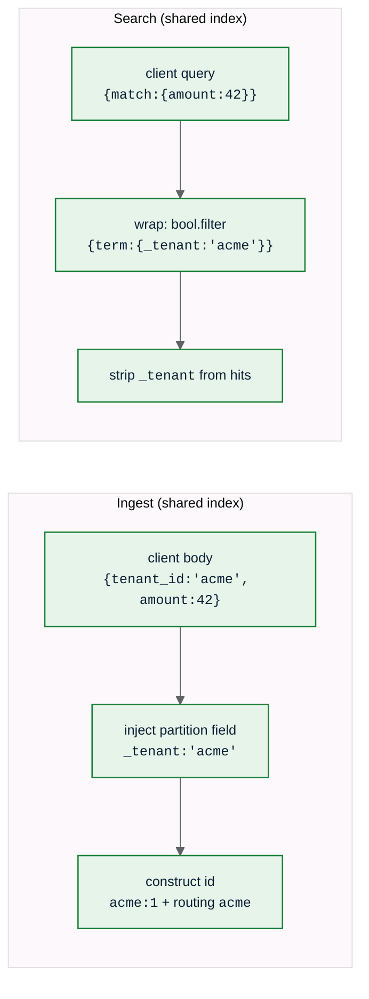
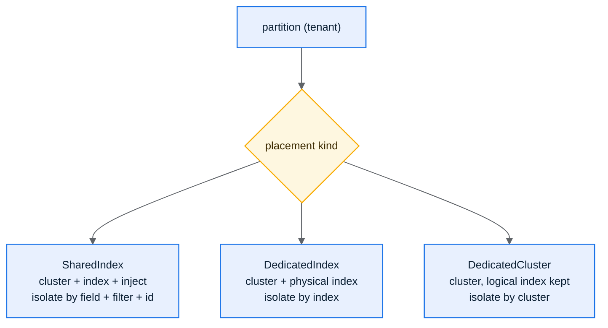

# 3. Architecture

osproxy is a statically-linked Rust library and binary. You implement the SPI; the
engine runs each request through a fixed pipeline. Nothing on the hot path is
dynamically dispatched. Your `TenancySpi` and `Sink` are monomorphized into the
pipeline at compile time.

## Request lifecycle

A few things are worth understanding about this flow.

The introspection surfaces (`/metrics`, `/debug/*`, `/admin/directives`) short-circuit
before authentication, and each is individually gated (see
[Observability](08-observability.md)). Everything below them is the data plane.

The TLS gate is a hard rule (NFR-S1): a body-mutating request over cleartext is refused
with `403` before any work happens. You cannot rewrite an encrypted stream, so the
proxy has to terminate TLS to do tenancy at all.

Credentials are consumed at the edge. The `Authenticator` reads the client
`Authorization`, then the handler strips it before the request enters the pipeline, so
it never reaches the engine, the upstream, observability, or logs.

Resolution is partition-first. The `Router` turns the request into a `(partition,
placement, target)` triple plus a body transform. The engine needs the partition (not
just a routing decision) to construct ids and demux bulk, which is why it consumes the
richer result. During a migration the write gate re-checks the epoch at dispatch and
rejects a write that resolved against a now-stale placement as a retryable `409`.

Around all of it, the trace recorder emits shape-only spans for every request, success
or failure.

## The two body transforms

The partition filter is a **structural enclosure**: your query becomes the `must`
clause inside a `bool` that the proxy controls, with the partition `term` as a
mandatory `filter`. A client cannot remove or escape it (NFR-S4). For shared-index
placements the partition id is also mandatory in the document id template, so by-id
reads and writes can't collide across tenants. The router fails closed if a
shared-index placement lacks a partition-scoped id.

## Placement kinds

See [Tenancy & Placement](../03-tenancy-and-placement.md) for the full model and
[Partition Migration](../06-partition-migration.md) for epoch-gated cutover.

## Configuration model

Configuration is typed and **fully validated at startup, before any socket opens**.
It is layered with the precedence **file < environment < flags**; an invalid value is
a typed error naming the field. Live, fleet-wide changes (placement table,
diagnostics directives) flow through the **control plane** at runtime, not via
config-file reload. See [Configuration](07-configuration.md) and
[Observability & Control Plane](08-observability.md).

→ [Components (Package View)](04-components.md)
