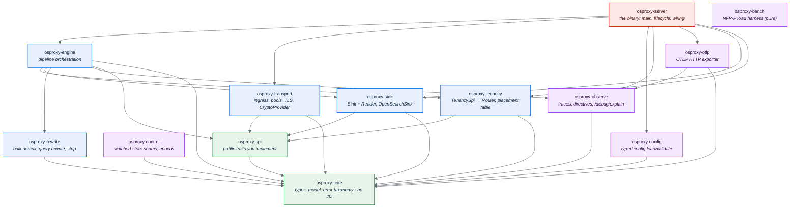

# 4. Components (Package View)

osproxy is a Cargo **workspace of small, single-responsibility crates**. The golden
rule is a **strict downward dependency direction**: lower crates never depend on
higher ones. `osproxy-core` depends on nothing in the workspace; only the
`osproxy-server` binary depends on everything.

## Package diagram

## Crate responsibilities

| Crate | Owns | Depends on |
|-------|------|------------|
| **osproxy-core** | Vocabulary types (`PartitionId`, `ClusterId`, `Target`, `Epoch`, `RequestId`…), the request/decision model, the **error taxonomy**, the `Clock`/`CursorSigner` seams. **No I/O.** | (nothing) |
| **osproxy-spi** | The public traits you `impl`: `TenancySpi`, `RoutingSpi`, `Authenticator`, `Authorizer`, plus the value types (`Placement`, `RequestCtx`, `RouteDecision`, `SpiError`…). | core |
| **osproxy-tenancy** | Adapts your high-level `TenancySpi` into the engine's `Router` seam; the in-memory epoch-versioned `PlacementTable`; the SharedIndex partition-in-id invariant. | spi, core |
| **osproxy-rewrite** | NDJSON/`_bulk` demux, query-DSL partition-filter wrap, response field-strip, doc-id construction, partition extraction. | core |
| **osproxy-sink** | The `Sink` (write) and `Reader` (get/search/count/cursor) traits + `OpenSearchSink` (and `MemorySink` for tests). Per-cluster pools live here, built lazily from the endpoint each placement reports (no static catalog). | spi, core |
| **osproxy-transport** | h1/h2/gRPC ingress, admission control (413/429), the upstream connection pools, TLS/mTLS, the `CryptoProvider` seam and the build-time `DefaultCryptoProvider`. | spi, core |
| **osproxy-engine** | The request **pipeline**: dispatch by endpoint, resolve → write-gate → transform → dispatch → reverse-transform, and the per-request trace. Generic over `Router` + `Sink`. | tenancy, sink, rewrite, observe, spi, core |
| **osproxy-observe** | Shape-only causal traces, the diagnostics **directive** model (level/targeting/TTL/sampling), `/debug/explain` assembly, break-glass tape, the OTLP `resource_spans` encoder, `/metrics` snapshot, the `DirectiveStore`/`SpanExporter`/`DirectiveVerifier` seams. | core |
| **osproxy-control** | The watched-store **client seams** for the placement table and diagnostics directives (epoch-aware). Ships seams + reference impls, not a concrete distributed store. | core |
| **osproxy-otlp** | `OtlpHttpExporter`, which POSTs encoded spans to an OTLP collector, fire-and-forget hardened. | observe, core |
| **osproxy-capture** | The `Capture` seam for tenant-agnostic, full-fidelity traffic capture (`CaptureRecord`, `NoCapture`, the `RedactingCapture` decorator, `MemoryCapture`). A low leaf with no broker dependency, so an external recorder can implement it. | spi |
| **osproxy-kafka** | Queue-backed capture: the `CaptureEnvelope` replay format, a `Producer` seam, `KafkaCapture`, and an in-memory producer. The actual Kafka client composes in as a `Producer` impl, so no broker dependency lives in the tree. | capture |
| **osproxy-config** | Typed config load/validate (file → env → flags), all defaults applied once. No business logic. | core |
| **osproxy-server** | The `osproxy` binary: `main`, signal handling, graceful drain, and the **reference wiring** of every crate. Also home to the reference `TenancySpi`, `Authenticator`, and the HTTP handler (`AppHandler`). | everything above |
| **osproxy-bench** | The pure NFR-P harness: latency percentiles, proxy-vs-baseline profiles, scalability curve, footprint. Emits the JSON an LLM judge consumes. | core (test-only) |

## Why this shape

- **The SPI is the narrow waist.** You compile against `osproxy-spi` (+ `osproxy-core`
  types). Everything above it is the proxy's job; everything you provide is below the
  pipeline. ([ADR-007](../decisions/007-static-spi.md))
- **Seams, not frameworks.** `Sink`, `DirectiveStore`, `SpanExporter`,
  `CryptoProvider`, `Clock`, `CursorSigner` are trait seams with in-tree default
  implementations. You swap what you need; the rest stays at a zero-cost null object.
- **No god modules.** File/module size and cohesion budgets are enforced in CI
  (NFR-Q1), which is why responsibilities are split this finely.

For the deeper rationale and the enforced dependency DAG, see
[`docs/01-architecture.md`](../01-architecture.md) and
[`docs/08-engineering-standards.md`](../08-engineering-standards.md).

→ [The SPI](05-spi-guide.md)
