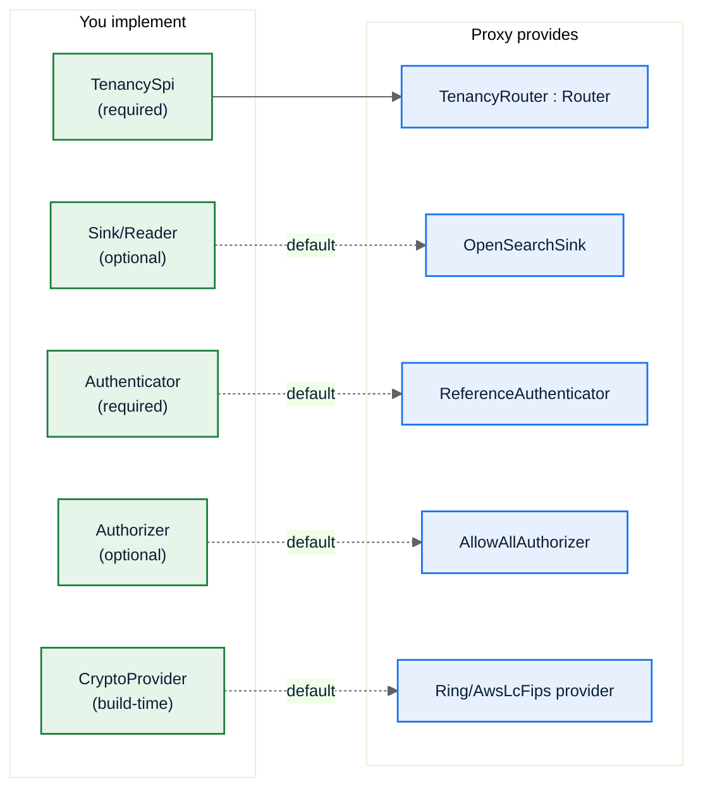

# 5. The SPI

The **Service Provider Interface** is the set of traits you implement. You depend on
`osproxy-spi` (and `osproxy-core` for the value types), implement what you need, and
the compiler statically links your logic into the proxy. Most integrators implement
just one trait, `TenancySpi`, and take defaults for the rest.



## `TenancySpi`: the one you almost always implement

`TenancySpi` declares your tenancy **rules** as data: how to find the partition, how
to build the document id, which fields to inject, which are sensitive, and how to look
up a partition's placement. `osproxy-tenancy` adapts it into the engine's `Router`,
so you never touch `RouteDecision` plumbing.

```rust
use osproxy_core::{ClusterId, Epoch, FieldName, IndexName, PartitionId};
use osproxy_spi::{
    DocIdRule, IdTemplate, InjectedField, InjectedValue, JsonPath, Placement, PlacementAt,
    PartitionKeySpec, SensitivitySpec, SpiError, TenancySpi,
};

struct MyTenancy;

impl TenancySpi for MyTenancy {
    /// Where the partition (tenant) id comes from. Here: a body field `tenant_id`.
    fn partition_key(&self) -> PartitionKeySpec {
        PartitionKeySpec::BodyField(JsonPath::new("tenant_id"))
    }

    /// How to build the physical document id. For SharedIndex the partition id is
    /// MANDATORY in the template (so two tenants can't collide on the same `_id`).
    fn doc_id_rule(&self) -> Option<DocIdRule> {
        Some(DocIdRule::new(IdTemplate::new("{partition}:{body.id}")).with_routing(true))
    }

    /// Fields injected on ingest and stripped on read (names chosen by you).
    fn injected_fields(&self) -> Vec<InjectedField> {
        vec![InjectedField::new(FieldName::from("_tenant"), InjectedValue::PartitionId)]
    }

    /// Fields whose VALUES must never appear in any trace (NFR-S2).
    fn sensitive_fields(&self) -> SensitivitySpec {
        SensitivitySpec::new(vec![FieldName::from("ssn")])
    }

    /// Resolve a partition to its current placement and the epoch it was read at.
    /// NOT pure: migration mutates placement; back it with your control-plane store.
    async fn placement_for(&self, partition: &PartitionId) -> Result<PlacementAt, SpiError> {
        Ok(PlacementAt::new(
            Placement::SharedIndex {
                cluster: ClusterId::from("eu-1"),
                index: IndexName::from("orders-shared"),
                inject: self.injected_fields(),
            },
            Epoch::ZERO,
        ))
    }

    // `admit_write` has a default (always-admit). Override it only if you run live
    // migrations and need to hold writes during cutover (see Partition Migration).
}
```

### Invariants you must uphold

- `partition_key` must resolve for every routable request, or the request is rejected
  with `PartitionUnresolved`.
- In `SharedIndex` mode the partition id **must** be part of the constructed `_id`
  (the router enforces this and fails closed otherwise; see [Architecture](03-architecture.md)).
- `injected_fields` names and `sensitive_fields` must be **stable** for a given
  logical-index version, so read-path strip stays symmetric with write-path inject.

### Partition key sources

| `PartitionKeySpec` | Source |
|--------------------|--------|
| `BodyField(JsonPath)` | A field in the request/document body (e.g. `tenant_id`). |
| `Header(String)` | A request header (e.g. `x-tenant`). |
| …  | See `osproxy-spi::rules` for the full set. |

## `Authenticator` (required)

Turns client credentials (bearer token and/or verified mTLS subject) into a
`Principal`. The reference binary ships `ReferenceAuthenticator` (static token map +
dev mode); real deployments provide their own (JWT, an IdP, etc.).

```rust
use osproxy_core::PrincipalId;
use osproxy_spi::{Authenticator, AuthError, ClientCredentials, Principal};

struct TokenAuth;

impl Authenticator for TokenAuth {
    async fn authenticate(&self, creds: &ClientCredentials) -> Result<Principal, AuthError> {
        let token = creds.bearer_token.as_deref().ok_or(AuthError::MissingCredentials)?;
        // … validate token …
        Ok(Principal::new(PrincipalId::from(token)))
    }
}
```

## `Authorizer` (optional): post-authentication policy

Decides whether an authenticated `Principal` may perform an `Action` (endpoint +
logical index). The default is `AllowAllAuthorizer` (no second policy layer), wired
via `AppHandler::with_authorizer(...)`.

```rust
use osproxy_spi::{Action, AuthError, Authorizer, Principal};
use osproxy_core::EndpointKind;

struct ReadOnlyForGuests;

impl Authorizer for ReadOnlyForGuests {
    async fn authorize(&self, principal: &Principal, action: &Action) -> Result<(), AuthError> {
        let is_write = matches!(
            action.endpoint,
            EndpointKind::IngestDoc | EndpointKind::IngestBulk | EndpointKind::DeleteById
        );
        if principal.id().as_str() == "guest" && is_write {
            return Err(AuthError::Unauthorized); // → 403, before any routing/upstream
        }
        Ok(())
    }
}
```

## `Sink` / `Reader` (optional): swap the backend

`Sink` applies write batches; `Reader` answers get/search/count/cursor. The default
is `OpenSearchSink`. The trait is the seam that makes a future **Kafka-based
redundancy** sink a drop-in ([ADR-008](../decisions/008-sink-trait-deferred-redundancy.md)).
You rarely implement these unless you are changing the write backend.

```rust
use osproxy_sink::{Sink, WriteAck, WriteBatch, SinkError};

struct MySink;

impl Sink for MySink {
    fn write(&self, batch: WriteBatch)
        -> impl std::future::Future<Output = Result<WriteAck, SinkError>> + Send
    {
        async move { /* deliver each WriteOp; return per-op acks */ todo!() }
    }
}
```

## `Router` (advanced): custom routing that bypasses tenancy

The engine pipeline is generic over `osproxy_tenancy::Router` (not the concrete
`TenancyRouter`). Implementing `Router` directly lets you drive the engine with
routing that isn't tenancy-shaped. It is richer than `RoutingSpi` (it surfaces the
resolved partition, epoch, and migration phase the engine needs). Most users never
implement it. `TenancyRouter` already implements `Router` for your `TenancySpi`.

> `RoutingSpi` is the **single-decision** contract (`route → RouteDecision`). It is
> what `TenancyRouter` exposes for callers that only need a decision. To drive the
> *engine*, implement `Router`.

## `CryptoProvider` (build-time selection)

TLS is provided by a `CryptoProvider`, selected at **build time** by a Cargo feature,
not at runtime ([ADR-004](../decisions/004-fips-aws-lc-rs.md)):

- default (`non-fips`) → `RingProvider` (pure-Rust `ring`, fast dev builds, **not**
  FIPS).
- `--features fips` → `AwsLcFipsProvider` (CMVP-validated AWS-LC in FIPS mode).

`DefaultCryptoProvider` aliases whichever is compiled in; `fips_mode()` reports which.
See [FIPS & Crypto](../07-fips-and-crypto.md).

## Error taxonomy

Every fallible SPI call returns a typed `SpiError` (or `AuthError`/`SinkError`); the
engine maps each to a stable code, an HTTP status, a `retryable` flag, and a
remediation hint (NFR-T5). No string errors on the request path (NFR-R2). See
[`docs/02-spi.md`](../02-spi.md) §errors for the full list.

→ [Wiring It Together](06-wiring-example.md)
