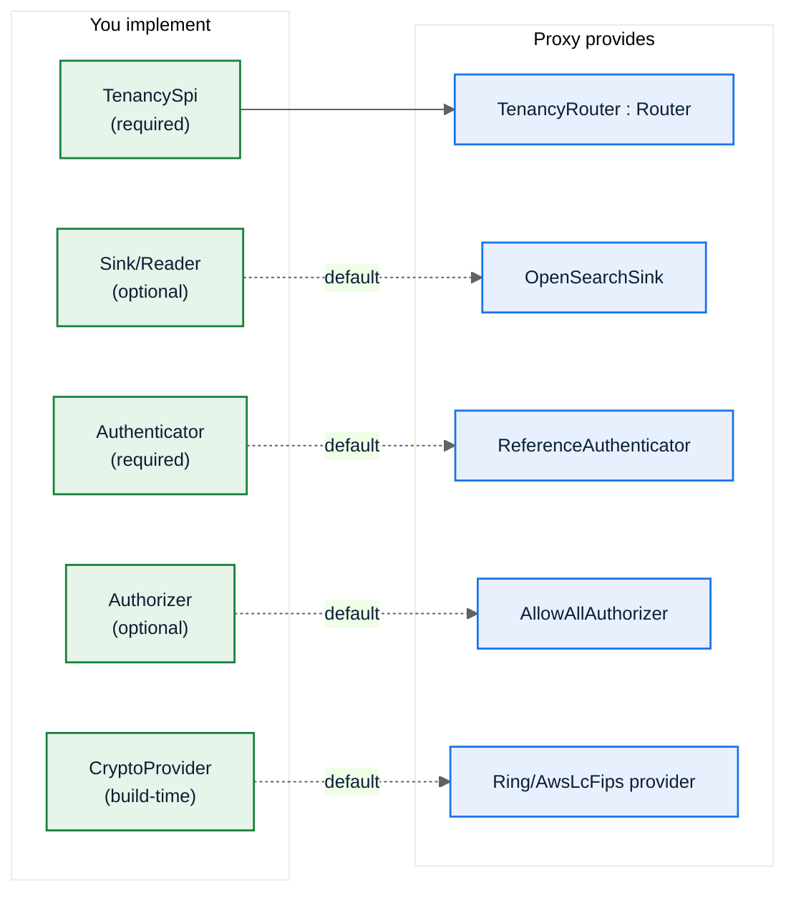

# 5. The SPI

The **Service Provider Interface** is the set of traits you implement. You depend on
`osproxy-spi` (and `osproxy-core` for the value types), implement what you need, and
the compiler statically links your logic into the proxy. Most integrators implement
just one trait, `TenancySpi`, and take defaults for the rest.



## `TenancySpi`: the one you almost always implement

`TenancySpi` declares your tenancy **rules** as data: how to find the partition, how
to build the document id, which fields to inject, which are sensitive, and how to look
up a partition's placement. `osproxy-tenancy` adapts it into the engine's `Router`,
so you never touch `RouteDecision` plumbing.

```rust
use osproxy_core::{ClusterId, Epoch, FieldName, IndexName, PartitionId};
use osproxy_spi::{
    BodyDoc, DocIdRule, IdTemplate, InjectedField, InjectedValue, JsonPath, Placement, PlacementAt,
    PartitionKeySpec, RequestCtx, SensitivitySpec, SpiError, TenancySpi,
};

struct MyTenancy;

impl TenancySpi for MyTenancy {
    /// Resolve the partition (tenant) id. Here we defer to the declarative
    /// resolver, naming a body field `tenant_id`. (Override the body to decode an
    /// encoded header or combine inputs, see "Deriving the partition with code".)
    fn resolve_partition(&self, ctx: &RequestCtx<'_>, body: BodyDoc<'_>)
        -> Result<PartitionId, SpiError>
    {
        osproxy_tenancy::resolve_partition_spec(
            &PartitionKeySpec::BodyField(JsonPath::new("tenant_id")), ctx, body)
    }

    /// How to build the physical document id. For SharedIndex the partition id is
    /// MANDATORY in the template (so two tenants can't collide on the same `_id`).
    fn doc_id_rule(&self) -> Option<DocIdRule> {
        Some(DocIdRule::new(IdTemplate::new("{partition}:{body.id}")).with_routing(true))
    }

    /// Fields injected on ingest and stripped on read (names chosen by you).
    /// `PartitionId` is the isolation field the read path filters on. Other
    /// values are decorative: injected and stripped, and may be context-derived.
    fn injected_fields(&self) -> Vec<InjectedField> {
        vec![
            InjectedField::new(FieldName::from("_tenant"), InjectedValue::PartitionId),
            // Dynamic from request context: e.g. a region set by a gateway header.
            InjectedField::new(
                FieldName::from("_region"),
                InjectedValue::FromHeader("x-region".into()),
            ),
        ]
    }

    /// Which field VALUES observability may capture (NFR-S2). Deny-by-default:
    /// everything is sensitive unless allow-listed. `all_sensitive()` is the
    /// default if you don't override this at all.
    fn sensitive_fields(&self) -> SensitivitySpec {
        SensitivitySpec::allowing(vec![FieldName::from("status")]) // status is safe
    }

    /// Resolve a partition to its current placement, the epoch it was read at,
    /// and the cluster's base URL (the sink pools that endpoint on first use;
    /// the tenancy is the source of truth for where each cluster lives). NOT
    /// pure: migration mutates placement; back it with your control-plane store.
    async fn placement_for(&self, partition: &PartitionId) -> Result<PlacementAt, SpiError> {
        Ok(PlacementAt::new(
            Placement::SharedIndex {
                cluster: ClusterId::from("eu-1"),
                index: IndexName::from("orders-shared"),
                inject: self.injected_fields(),
            },
            Epoch::ZERO,
        )
        .with_endpoint("https://eu-1.internal:9200"))
    }

    // `admit_write` has a default (always-admit). Override it only if you run live
    // migrations and need to hold writes during cutover (see Partition Migration).
}
```

`placement_for` returns any of the three `Placement` kinds, and the choice is the
isolation model: `SharedIndex` (isolate by an injected field + a partition-scoped
id — the only kind that rewrites the body), `DedicatedIndex` (isolate by a
per-partition physical index), or `DedicatedCluster` (isolate by cluster). The
shipped `ReferenceTenancy` demonstrates all three — `with_placement_mode(...)`
switches between them — and the [mode-overhead numbers](11-performance.md#choosing-a-mode-routing-vs-body-rewrite-cost)
show the choice is about isolation, not latency (all three add ~0.1–0.3 ms).

### Invariants you must uphold

- `resolve_partition` must yield a partition id for every routable request, or it
  returns `PartitionUnresolved` and the request is rejected.
- In `SharedIndex` mode the partition id **must** be part of the constructed `_id`
  (the router enforces this and fails closed otherwise; see [Architecture](03-architecture.md)).
- `injected_fields` names must be **stable** for a given logical-index version, so
  read-path strip stays symmetric with write-path inject. Read isolation filters on
  the `PartitionId` field only; decorative fields (`Constant`, `FromPrincipal`,
  `FromHeader`) are injected and stripped but never filtered, so their value may be
  context-dependent.
- `sensitive_fields` is **deny-by-default**: every value is redacted unless you
  allow-list it as safe. A field you add later is protected automatically.

### Partition key sources

For the common case the id lives somewhere a name can point at, hand a
`PartitionKeySpec` to `osproxy_tenancy::resolve_partition_spec` (as the example
above does). It reports `PartitionUnresolved { tried }` listing the sources it
attempted:

| `PartitionKeySpec` | Source |
|--------------------|--------|
| `BodyField(JsonPath)` | A field in the request/document body (e.g. `tenant_id`). |
| `Header(String)` | A request header read verbatim (e.g. `x-tenant`). |
| `PrincipalAttr(String)` | An attribute of the authenticated `Principal`. |
| `AnyOf(Vec<…>)` | Try each source in order until one resolves. |

### Deriving the partition with code

When the id is not sitting in a header verbatim (a signed token, a base64 blob, a
claim inside a structured header), write the `resolve_partition` body yourself.
You get the full `RequestCtx` (headers, principal, path, query, body) and the
body as a `BodyDoc`, a byte-scan view, **not** a parsed `serde_json::Value` tree
(read a scalar with `body.scalar(path)`; the proxy never materializes the doc,
ADR-014). **You** pick the order, decode first, then fall back to the
declarative resolver if you like:

```rust
impl TenancySpi for MyTenancy {
    fn resolve_partition(&self, ctx: &RequestCtx<'_>, body: BodyDoc<'_>)
        -> Result<PartitionId, SpiError>
    {
        if let Some(raw) = ctx.headers().get("x-tenant-token") {
            // Decode/verify your encoded header. The decoded value is a routing
            // key, never logged (NFR-S2).
            if let Some(claim) = decode_and_verify(raw) {
                return Ok(PartitionId::from(claim.tenant.as_str()));
            }
        }
        // Fall back to a declarative source for requests the token path misses.
        osproxy_tenancy::resolve_partition_spec(
            &PartitionKeySpec::Header("x-tenant".to_owned()), ctx, body)
    }
    // … doc_id_rule / injected_fields / … as above.
}
```

### Telling the proxy where clusters live

The sink has no static endpoint catalog. Your tenancy is the source of truth for
where each cluster lives, and it reports that in two places.

The data plane reads it from the placement result: `placement_for` attaches the
cluster's base URL with `PlacementAt::with_endpoint(...)` (shown above), and the
sink builds a pool for that URL the first time it routes there.

The scroll/PIT affinity and admin pass-through paths route to a cluster by id with
no placement to consult (a bare scroll continue carries only the pinned cluster in
its signed envelope). For those, implement `cluster_endpoint`, a by-id lookup the
engine calls server-side. Keeping it server-side is deliberate: the cluster's URL
never goes into the client-visible cursor token.

```rust
impl TenancySpi for MyTenancy {
    fn cluster_endpoint(&self, cluster: &ClusterId) -> Option<String> {
        self.catalog.get(cluster).cloned() // your cluster-id → base-URL map
    }
}
```

The default returns `None`. A tenancy that never uses cursor affinity or admin
pass-through can skip it; one that does must cover the clusters those paths reach,
which is just its own cluster catalog by id.

## `Authenticator` (required)

Turns client credentials (bearer token and/or verified mTLS subject) into a
`Principal`. The reference binary ships `ReferenceAuthenticator` (static token map +
dev mode); real deployments provide their own (JWT, an IdP, etc.).

```rust
use osproxy_core::PrincipalId;
use osproxy_spi::{Authenticator, AuthError, ClientCredentials, Principal};

struct TokenAuth;

impl Authenticator for TokenAuth {
    async fn authenticate(&self, creds: &ClientCredentials) -> Result<Principal, AuthError> {
        let token = creds.bearer_token.as_deref().ok_or(AuthError::MissingCredentials)?;
        // … validate token …
        Ok(Principal::new(PrincipalId::from(token)))
    }
}
```

## `Authorizer` (optional): post-authentication policy

Decides whether an authenticated `Principal` may perform an `Action` (endpoint +
logical index). The default is `AllowAllAuthorizer` (no second policy layer), wired
via `AppHandler::with_authorizer(...)`.

```rust
use osproxy_spi::{Action, AuthError, Authorizer, Principal};
use osproxy_core::EndpointKind;

struct ReadOnlyForGuests;

impl Authorizer for ReadOnlyForGuests {
    async fn authorize(&self, principal: &Principal, action: &Action) -> Result<(), AuthError> {
        let is_write = matches!(
            action.endpoint,
            EndpointKind::IngestDoc | EndpointKind::IngestBulk | EndpointKind::DeleteById
        );
        if principal.id().as_str() == "guest" && is_write {
            return Err(AuthError::Unauthorized); // → 403, before any routing/upstream
        }
        Ok(())
    }
}
```

## `Sink` / `Reader` (optional): swap the backend

`Sink` applies write batches; `Reader` answers get/search/count/cursor. The default
is `OpenSearchSink`. The trait is the seam that makes a future **Kafka-based
redundancy** sink a drop-in ([ADR-008](../decisions/008-sink-trait-deferred-redundancy.md)).
You rarely implement these unless you are changing the write backend.

```rust
use osproxy_sink::{Sink, WriteAck, WriteBatch, SinkError};

struct MySink;

impl Sink for MySink {
    fn write(&self, batch: WriteBatch)
        -> impl std::future::Future<Output = Result<WriteAck, SinkError>> + Send
    {
        async move { /* deliver each WriteOp; return per-op acks */ todo!() }
    }
}
```

## `Router` (advanced): custom routing that bypasses tenancy

The engine pipeline is generic over `osproxy_tenancy::Router` (not the concrete
`TenancyRouter`). Implementing `Router` directly lets you drive the engine with
routing that isn't tenancy-shaped. It is richer than `RoutingSpi` (it surfaces the
resolved partition, epoch, and migration phase the engine needs). Most users never
implement it. `TenancyRouter` already implements `Router` for your `TenancySpi`.

> `RoutingSpi` is the **single-decision** contract (`route → RouteDecision`). It is
> what `TenancyRouter` exposes for callers that only need a decision. To drive the
> *engine*, implement `Router`.

## `CryptoProvider` (build-time selection)

TLS is provided by a `CryptoProvider`, selected at **build time** by a Cargo feature,
not at runtime ([ADR-004](../decisions/004-fips-aws-lc-rs.md)):

- default (`non-fips`) → `RingProvider` (pure-Rust `ring`, fast dev builds, **not**
  FIPS).
- `--features fips` → `AwsLcFipsProvider` (CMVP-validated AWS-LC in FIPS mode).

`DefaultCryptoProvider` aliases whichever is compiled in; `fips_mode()` reports which.
See [FIPS & Crypto](../07-fips-and-crypto.md).

## Error taxonomy

Every fallible SPI call returns a typed `SpiError` (or `AuthError`/`SinkError`); the
engine maps each to a stable code, an HTTP status, a `retryable` flag, and a
remediation hint (NFR-T5). No string errors on the request path (NFR-R2). See
[`docs/02-spi.md`](../02-spi.md) §errors for the full list.

→ [Wiring It Together](06-wiring-example.md)
