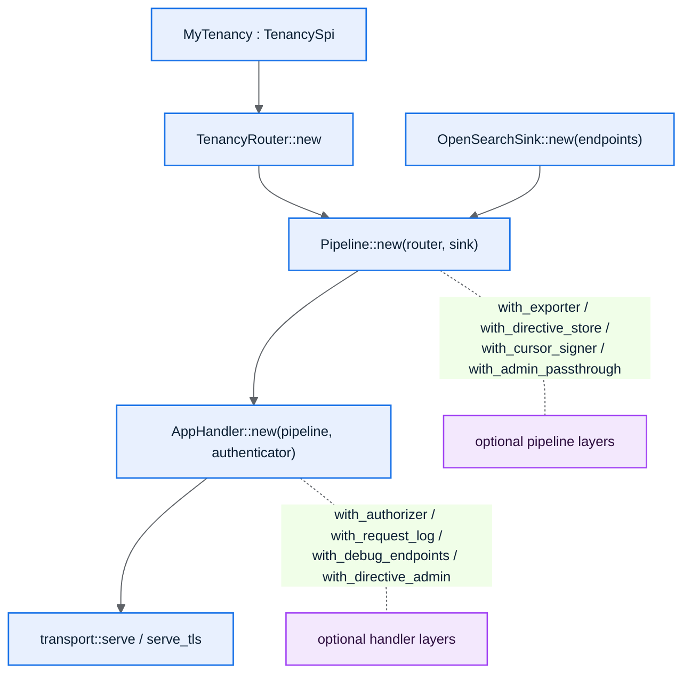

# 6. Wiring It Together

This page shows how the crates assemble into a running proxy. The composition is
**builder-based with sensible defaults**: `Pipeline::new(router, sink)` and
`AppHandler::new(pipeline, authenticator)` are complete on their own; every
`with_*` adds an optional, off-by-default capability.

## How the pieces fit



## Minimal: a working proxy in ~20 lines

```rust
use std::collections::HashMap;
use std::sync::Arc;

use osproxy_core::ClusterId;
use osproxy_engine::Pipeline;
use osproxy_sink::OpenSearchSink;
use osproxy_tenancy::TenancyRouter;
use osproxy_server::auth::ReferenceAuthenticator;
use osproxy_server::handler::AppHandler;
use tokio::net::TcpListener;

#[tokio::main]
async fn main() -> std::io::Result<()> {
    // 1. Where writes/reads go: one cluster id → its base URL.
    let mut endpoints = HashMap::new();
    endpoints.insert(ClusterId::from("eu-1"), "http://127.0.0.1:9200".to_owned());
    let sink = OpenSearchSink::new(endpoints);

    // 2. Your tenancy rules, adapted into the engine's Router.
    let router = TenancyRouter::new(MyTenancy);

    // 3. The pipeline (defaults: no export, allow-all, no diagnostics cost).
    let pipeline = Pipeline::new(router, sink);

    // 4. The HTTP handler (dev auth: accepts any caller, never for prod).
    let handler = Arc::new(
        AppHandler::new(pipeline, ReferenceAuthenticator::dev())
            // Cleartext test harness only; default refuses mutating cleartext (NFR-S1).
            .with_require_tls_for_mutation(false),
    );

    // 5. Serve HTTP/1.1 + HTTP/2 on one listener.
    let listener = TcpListener::bind("127.0.0.1:8080").await?;
    osproxy_transport::serve(listener, handler).await
}
```

## Fuller: the optional layers

Each layer below is independent and off until you add it. This mirrors the reference
binary's `assemble_pipeline` ([`crates/osproxy-server/src/main.rs`](../../crates/osproxy-server/src/main.rs)).

```rust
use std::sync::Arc;
use osproxy_core::SystemClock;
use osproxy_engine::AdminPolicy;
use osproxy_observe::{DiagLevel, InMemoryDirectiveStore};
use osproxy_otlp::OtlpHttpExporter;

let directive_store = Arc::new(InMemoryDirectiveStore::new());

let pipeline = Pipeline::new(TenancyRouter::new(MyTenancy), sink)
    // Export shape-only spans to an OTLP collector (off unless set).
    .with_exporter(Arc::new(OtlpHttpExporter::new("http://otel-collector:4318")))
    .with_service_name("osproxy")
    // Baseline diagnostics verbosity before any directive raises it.
    .with_baseline_level(DiagLevel::Shape)
    // Fleet-wide runtime directives, polled fresh per request (flip without restart).
    .with_directive_store(directive_store.clone())
    // Opt-in scroll/PIT affinity: same HMAC key on every fleet instance.
    .with_cursor_signer(Arc::new(my_cursor_signer))
    // Opt-in admin pass-through (allow-listed _cat/_cluster/_nodes).
    .with_admin_passthrough(AdminPolicy::new(
        ClusterId::from("admin-1"),
        vec!["/_cat/".to_owned(), "/_cluster/".to_owned()],
    ));

let handler = AppHandler::new(pipeline, my_authenticator)
    // Post-auth policy (default allow-all).
    .with_authorizer(my_authorizer)
    // Structured JSON request log lines (off by default).
    .with_request_log(Box::new(osproxy_server::log::StdoutJsonLog))
    // Turn the pre-auth /debug/* surfaces off in production.
    .with_debug_endpoints(false)
    // Privileged POST/GET /admin/directives, token-gated.
    .with_directive_admin(directive_store, "s3cr3t-admin".to_owned(), Arc::new(SystemClock));
```

## Serving with TLS / mTLS

Build a `DefaultCryptoProvider` from PEM files and serve over TLS. Add a client CA to
require **mutual** TLS:

```rust
use osproxy_transport::DefaultCryptoProvider;

let cert = std::fs::read("server.crt")?;
let key  = std::fs::read("server.key")?;

let provider = Arc::new(
    // mTLS: clients must present a cert chaining to this CA.
    DefaultCryptoProvider::from_pem_mtls(&cert, &key, &std::fs::read("client-ca.crt")?)
        .expect("valid TLS material"),
);

osproxy_transport::serve_tls_with_shutdown(listener, provider, handler, shutdown()).await?;
```

For **gRPC ingress**, bind a second listener and call `serve_grpc` / `serve_grpc_tls`
with the same handler. Same pipeline, tenancy, and observability.

## You usually don't write `main` at all

The `osproxy-server` binary already wires all of this and drives it from
[configuration](07-configuration.md). The common path is:

1. Replace the reference `TenancySpi` (and optionally `Authenticator`) with yours.
2. Configure the rest via environment variables / a config file.
3. Run the binary.

Use the snippets above when you embed osproxy in your own service or need a custom
composition.

→ [Configuration](07-configuration.md)
