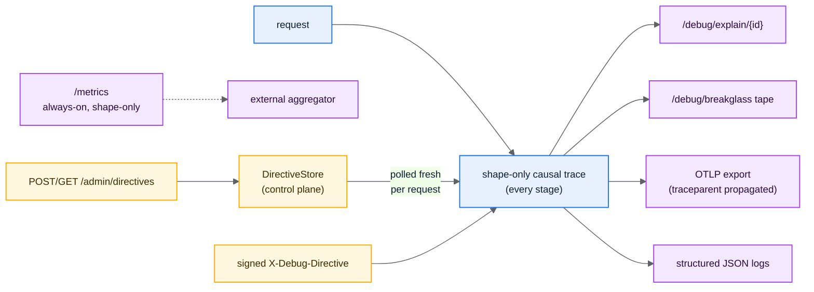
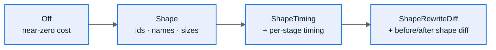
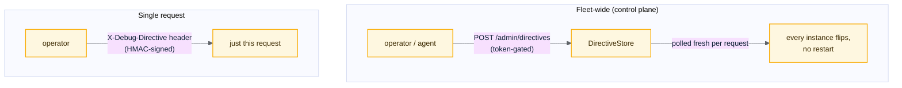
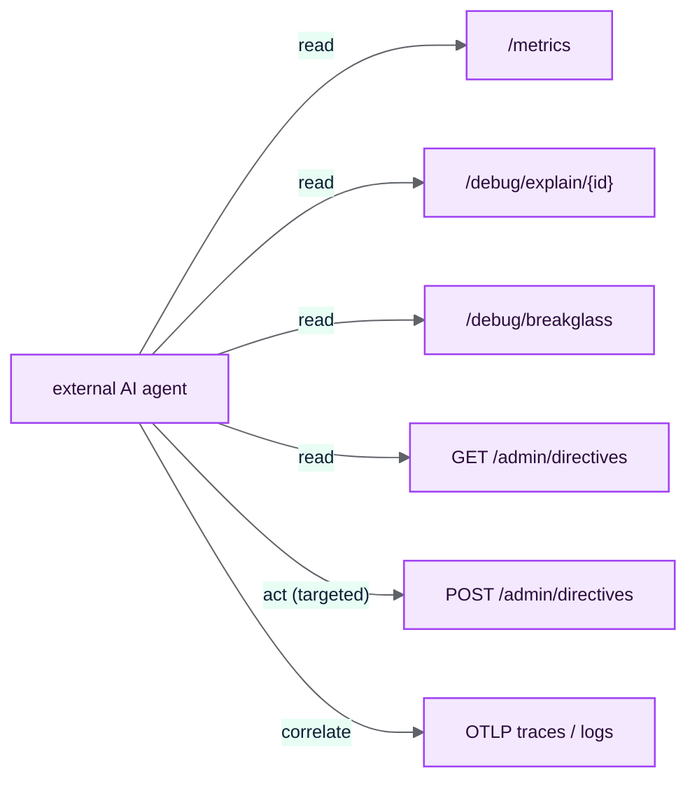

# 8. Observability, Tracing & the Control Plane

osproxy's observability has one overriding goal: **an external agent (human or LLM)
can diagnose any request failure without reading source code**, and do it
**without ever seeing a tenant value, token, or document body** (NFR-T1, NFR-T2,
NFR-S2). This page covers the causal trace, the debug surfaces, runtime directives,
the control plane, OTLP export, `/metrics`, and how an LLM uses it all.



## The shape-only causal trace

Every request, whether it succeeds or fails, produces one **causal trace**: a sequence of
spans recording *what happened at each stage* (classify → resolve → write-gate →
rewrite → dispatch → egress) and the ids/shapes involved. It records **shapes, ids,
and field names only**: partition id, endpoint kind, logical index name, status,
byte counts, the resolved target. **Never** tenant values, document contents, query
literals, tokens, or credentials. The no-value-leak rule is enforced by construction
(fields declared `sensitive` are suppressed) and verified by tests.

## `GET /debug/explain/{request_id}`

This is the surface you reach for first. It returns the full decision chain for a past
request as one JSON document an LLM can read (NFR-T4): the trace id, the resolved
partition, each stage's outcome, and on failure the failed stage, the stable error
code, `retryable`, and a remediation hint. Fetch it with the `x-request-id` echoed on
the response:

```bash
curl -s http://proxy:8080/debug/explain/req-42 | jq
```

```jsonc
{
  "request_id": "req-42",
  "trace_id": "4bf92f3577b34da6a3ce929d0e0e4736",
  "partition_id": "acme",
  "endpoint": "Search",
  "stages": [ { "stage": "resolve", "outcome": "ok", "target": "eu-1/orders-shared" }, … ],
  "outcome": "error",
  "error": { "code": "placement_missing", "retryable": false, "remediation": "…" }
}
```

> A shape-only doc: you can read it, an LLM can read it, and it never leaks a value.

## `GET /debug/breakglass`

The **forensic tape**: a bounded ring buffer of recent explain documents, captured
**only** while a `ring_buffer` directive is in effect (see below). It is the
operator-facing counterpart to single-request capture. Use it to grab the last N
requests around an incident, oldest first. Returns a JSON array.

## Production posture: the `/debug` switch

`/debug/explain` and `/debug/breakglass` are served **pre-auth** (so you can diagnose
even auth failures), but they expose operational metadata. In production, disable them
with `OSPROXY_DEBUG_ENDPOINTS=false` (or `AppHandler::with_debug_endpoints(false)`);
they then report `not_enabled`. `/metrics` stays on regardless: it is the
prod-safe surface (see below).

## Runtime diagnostics directives

Diagnostics verbosity is **togglable at runtime, fleet-wide, without a restart**, and
**targeted** so you pay only for the requests you care about (NFR-T3). A directive is:

| Field | Meaning |
|-------|---------|
| `id` | Stable management id (never a tenant value). |
| `match` | Targeting: any of `tenant`, `index`, `principal`, `endpoint`. An unset field is a wildcard; all-unset targets every request. |
| `level` | `Off` \| `Shape` \| `ShapeTiming` \| `ShapeRewriteDiff`. |
| `sample_per_mille` | Fraction of matching requests to record (0–1000; deterministic per request id). |
| `expires_at` | Absolute TTL. Matching auto-stops after expiry, no cleanup needed. |
| `ring_buffer` | Also capture matching requests into the break-glass tape (single-instance forensic ring). |
| `capture` | Tee matching requests to the fleet traffic-capture sink (full-fidelity Kafka capture). The runtime on switch for capture-on-demand. |

`capture` makes full-fidelity traffic capture **on demand**: with the sink wired
(the `capture_*` keys in [Configuration](07-configuration.md)) but
`capture_default = false`, nothing is teed until you publish a `capture` directive,
targeted by tenant/index/principal/endpoint, sampled, and TTL'd like any other.
Capture then turns on fleet-wide with no restart and turns itself back off at the
TTL. Distinct from `ring_buffer`, which is the local forensic tape; `capture` is
the durable stream for replay/audit/migration.

The effective level for a request is the **baseline raised by any matching
directive** (highest wins). With `diag_baseline = off`, nothing is recorded/exported
until a directive selects a request: surgical, sampled diagnostics with zero
steady-state cost.

### `DiagLevel` ladder



Every level above `Off` is still shape-only. `ShapeRewriteDiff` diffs the
*shape* of the rewrite, never the values.

## Two ways to apply a directive



1. **Fleet-wide** via `POST /admin/directives` (bearer-token-gated, fail-closed).
   The pipeline polls the `DirectiveStore` fresh per request, so a published set takes
   effect across the fleet **without a restart**. `GET /admin/directives` introspects
   what an instance currently applies (shape-only; an introspected directive
   re-publishes verbatim).
2. **Single request** via a signed `X-Debug-Directive` header (HMAC-verified with
   `OSPROXY_DEBUG_DIRECTIVE_KEY`). Clients cannot self-enable expensive tracing;
   only a holder of the shared key can sign one (NFR-S3).

## The control plane

The directive store and the placement table are **control-plane** state: they change
per request at runtime, not via config reload. osproxy ships the **seams**
(`DirectiveStore`, the migration store, an in-memory reference impl). The concrete
distributed/replicating backend (etcd, a watched store, …) is the operator's to
provide. The proxy polls the store fresh per request so any backend that publishes a
new snapshot flips behavior fleet-wide.

This is also how partition migration is driven: epoch-gated placement changes
flow through the control plane; see [Partition Migration](../06-partition-migration.md).

## OTLP export & distributed tracing

When `OSPROXY_OTLP_ENDPOINT` is set, osproxy exports the shape-only `SERVER` span to
an OTLP collector (fire-and-forget, drop-if-saturated, never blocking the request).
It then **participates in W3C trace-context**: the incoming `traceparent` is parsed,
the proxy span nests under the caller, and the proxy injects its own `traceparent`
into every upstream call (overriding the client's), so the proxy is a hop in your
distributed trace and `trace_id` ties the OTLP span, `/debug/explain`, and the
structured log together. Export cost is gated behind the exporter being enabled *and*
the effective diag level, so `Off` costs almost nothing.

**Tracing is transparent when export is off (the default).** With no exporter the
proxy adds no span and injects **no** `traceparent` of its own — it stays out of the
trace. The client's own trace headers instead pass straight through to the upstream
in the forwarded header set (see below), including non-W3C formats like **B3**
(Zipkin/Istio) that the proxy does not parse. So a proxy that is not itself
exporting never inserts a `traceparent` pointing at a span it never recorded.

## Forwarding client headers to the upstream

When the proxy forwards a request it rebuilds it for the upstream, so by default the
cluster would see only the headers the proxy manages. For a sidecar / transparent
deployment that is too lossy, so by default osproxy **relays the client's own
headers** to the cluster on every request — custom routing hints, vendor trace
headers (B3, …), and (by default) the client's `Authorization`. A mandatory set is
never relayed: hop-by-hop headers plus `host`/`content-length` (the proxy re-frames
the request). Control it with `forward_client_headers` (default `true`, sidecar
trust) and `forward_header_deny` (e.g. add `authorization` to keep the client
credential off the cluster); see [Configuration](07-configuration.md) and
[Request pipeline §11](../04-request-pipeline.md).

## `/metrics`, the always-on prod-safe surface

`GET /metrics` returns a shape-only operational snapshot: request totals/ok/error and
per-cluster upstream pool reuse counters (cluster ids only, no tenant data). It is
served **pre-auth and stays on in production** (it is the one introspection surface
meant to remain available when `/debug/*` is off). Fleet roll-up is an external
aggregator's job; each instance reports its own.

```bash
curl -s http://proxy:8080/metrics | jq
# { "requests_total": 1, "requests_ok": 1, "requests_error": 0,
#   "pools": [ { "cluster": "eu-1", "opened": 1, "dispatched": 1, "reused": 0 } ] }
```

## Structured request logs

With `OSPROXY_LOG_REQUESTS=true`, each request emits one structured JSON line, the
same shape-only explain document carrying `trace_id`, so your log pipeline joins the
traces and spans by id. Off by default.

## The LLM-driven debugging model

Putting it together, the substrate an external **AI agent** uses to observe and
operate a fleet, strictly read-only ([ADR-005](../decisions/005-readonly-ai-observability.md)):



- **Observe**: read `/metrics` for fleet health; pull `/debug/explain/{id}` for a
  failing request's full causal chain; read `/debug/breakglass` for the recent tape;
  correlate with OTLP traces/logs by `trace_id`.
- **Act, narrowly**: publish a targeted, sampled, TTL'd directive via
  `POST /admin/directives` to raise verbosity for exactly the tenant/index/endpoint
  under investigation, then read the richer traces it produces. `GET /admin/directives`
  shows what's in effect.
- **Never mutates cluster state.** The agent observes and tunes diagnostics; humans or
  automation perform any corrective action. Every error doc is self-describing
  (code + chain + `retryable` + remediation), so the agent can diagnose **without
  reading source**, the property the "blind diagnosis" test enforces.

The shape-only guarantee is what makes this safe: these surfaces can be exposed to an
agent (and, for `/metrics`, even left on in production) because **no value ever
leaves**.

## Where to go deeper

- Design rationale and span schema: [`docs/05-observability.md`](../05-observability.md).
- OTLP mapping: [`docs/specs/observability-otel.md`](../specs/observability-otel.md).
- The blind-diagnosis exit test: [`docs/09-testing-and-quality.md`](../09-testing-and-quality.md).

← Back to the [User Guide index](README.md)
