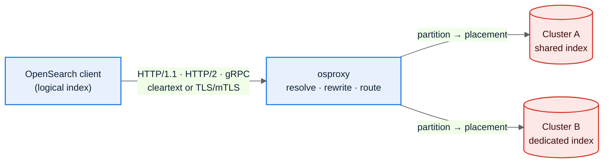

# osproxy User Guide

osproxy is an OpenSearch routing proxy you run as a Rust library. You implement a
few traits (the SPI), compile your routing logic statically into the binary, and put
it in front of one or more OpenSearch clusters. It is built for low latency, a small
footprint, and being debugged by an LLM without anyone reading source.

If you are new, read [Overview](01-overview.md), then go straight to
[Wiring It Together](06-wiring-example.md) for code you can run.

## Contents

| # | Guide | What it covers |
|---|-------|----------------|
| 1 | [Overview & Intent](01-overview.md) | What osproxy is, the problem it solves, what it deliberately leaves out. |
| 2 | [Requirements & NFRs](02-requirements-and-nfrs.md) | Functional scope and the performance, reliability, security, and traceability budgets a release must meet. |
| 3 | [Architecture](03-architecture.md) | The request lifecycle end to end, with diagrams. |
| 4 | [Components (Package View)](04-components.md) | Every crate, what it owns, and the dependency direction. |
| 5 | [The SPI](05-spi-guide.md) | The traits you implement (`TenancySpi`, `Authenticator`, `Authorizer`, `Sink`, `Router`, `CryptoProvider`) with examples. |
| 6 | [Wiring It Together](06-wiring-example.md) | A full program assembling a working proxy. |
| 7 | [Configuration](07-configuration.md) | Every setting, its env var, default, and meaning. |
| 8 | [Observability & Control Plane](08-observability.md) | Tracing, `/debug/explain`, break-glass, runtime directives, OTLP, metrics, and the LLM debugging model. |
| 9 | [Async Fan-out Clients](09-async-clients.md) | The `202`/`op_id` async write mode, mode negotiation, and how an OpenSearch client (e.g. Java) handles it. |
| 10 | [Choosing a Mode](10-choosing-a-mode.md) | Tenanted vs agnostic, sync vs async, capture, FIPS — which layer each knob lives at (build / config / per-request / runtime). |

## At a glance

A client sends traffic addressed to a logical index. osproxy reads the partition
(tenant) from the request, looks up that partition's placement, and routes to exactly
one physical cluster and index, rewriting the body and query so the tenant sees an
isolated view of its own data.

## What shapes the design

It is a library, not a platform. There are no dynamic plugins, no WASM, no dylibs.
You depend on `osproxy-spi`, implement traits, and the compiler checks your wiring.

Every advanced capability is off until you turn it on. TLS, gRPC, OTLP export,
runtime diagnostics, admin pass-through, and cursor affinity are builder layers a
minimal deployment never touches. Set nothing and you still get a working proxy.

The defaults lean safe. Mutating requests are refused over cleartext, isolation
fails closed, and diagnostics never emit a tenant value. And every request can
produce a shape-only causal trace good enough to diagnose a failure without opening
the code.

## Going deeper

This guide is the entry point. The design rationale lives in the numbered design
docs ([`docs/00`](../00-goals.md) through [`docs/14`](../14-performance.md)) and the
[architecture decision records](../decisions/README.md). Where a guide page
simplifies, it links to the design doc that holds the full story.
